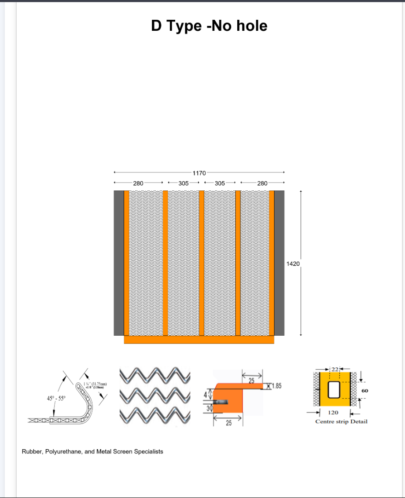

PU Harp Generator 
A fully functional web application to visually design and generate PU Harp configurations for industrial screening applications.
Built using Flask, Python, HTML/CSS, and PIL/OpenCV, this project enables users to customize spacing, strip styles, hook types, and more — then download the result as PDF.

---

🔍 Features

- 🎨 Live preview of generated PU harp based on user inputs
- 📐 Custom spacing, bar count, and strip layout
- 🔩 Optional center overlaps, hooks, poly ridge strips, and PU sickness representations
- 🧠 Validations: Ensures spacing and height values match properly
- 📎 Downloads: Save the output as high-resolution PDF
- 📱 Responsive UI and intuitive layout

---

 🛠️ Tech Stack

- Backend: Python, Flask
- Frontend: HTML5, CSS3 (custom), EJS-style templating via Jinja2
- Image Processing: NumPy, PIL (Pillow), OpenCV, Matplotlib
- PDF Export: ReportLab

---

 🚀 Getting Started

 1. Clone the repo
```bash
git clone https://github.com/PatelKrishna02/pu-screen-generator.git
cd pu-screen-generator
```

 2. Set up virtual environment
```bash
python -m venv venv
source venv/bin/activate  # Windows: venv\Scripts\activate
```

 3. Install dependencies
```bash
pip install -r requirements.txt
```

 4. Run the app
```bash
python app.py
```

Visit `http://127.0.0.1:5000` in your browser.

---

## 🖼️ Screenshots


 
 
 


 


---

 📄Use Case
A manufacturing engineer wants to visualize a custom PU screen configuration with 10 bars, specific spacings, and hook type 2. The user fills in the form, previews the layout, and downloads a production-ready PDF to send to suppliers.

---

 ✨ Why This Project Stands Out

- Combines UI design with custom image rendering
- Demonstrates full-stack ability: form handling, validations, image processing, and export
- Perfect for roles in web development, engineering interfaces, or industrial web tooling

---

 📫 Contact
**Krishna Patel**  
Bachelor of ICT (Cybersecurity & Ethical Hacking)  
Western Sydney University  
[LinkedIn](https://www.linkedin.com/in/krishnapatel16) • [GitHub](https://github.com/PatelKrishna02)

---

> ✨ Designed and built with love and loops.